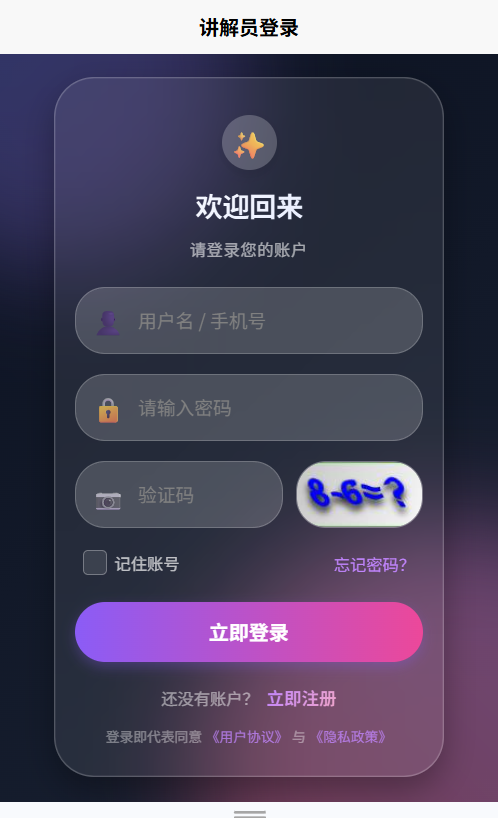
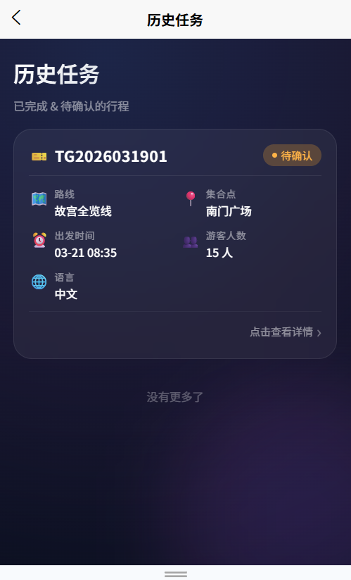
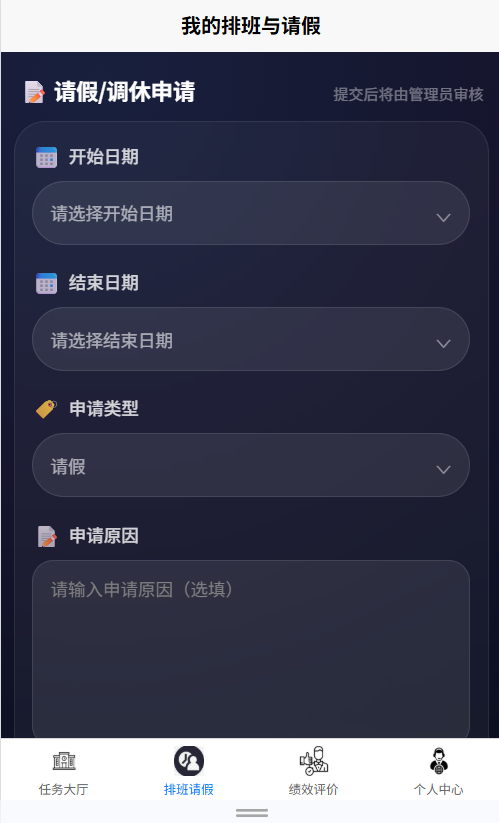
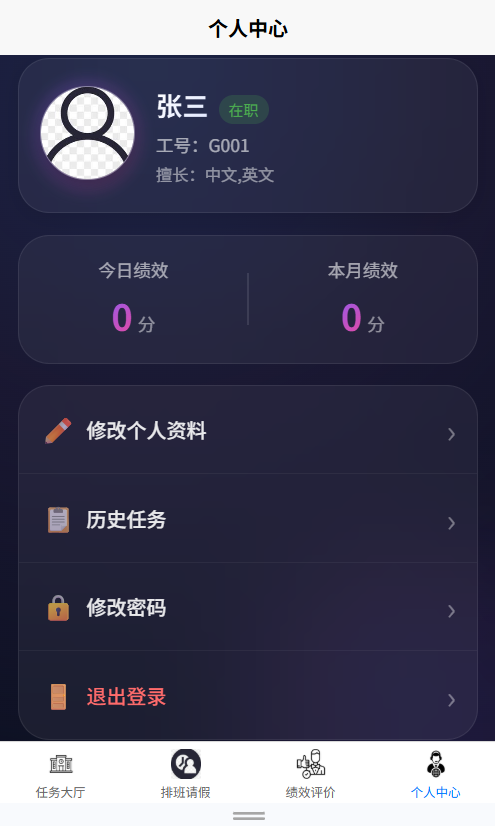
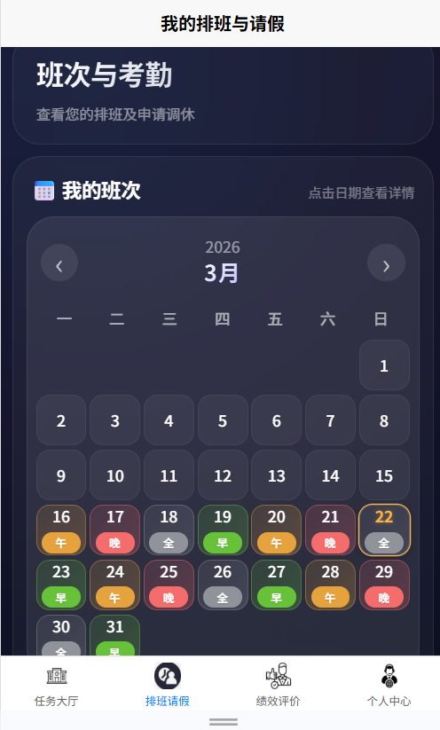

# guide-schedule-system（with load balance）

## 项目简介

**guide-schedule-system** 是一个基于 **Ruoyi** 框架开发的**带负载均衡的讲解员调度系统**。

- **后台管理**：ruoyi-ui（若依前后端分离管理端）
- **移动前端**：uni-app（支持小程序、H5、App 多端发布）

系统核心功能包括讲解员任务调度、排班管理、接单/完成任务、历史记录查询，并通过负载均衡机制实现高效的任务分配，适用于景区、博物馆、展会等需要讲解服务的场景。

## 技术栈

| 类别       | 技术                  |
|------------|-----------------------|
| 后端框架   | Ruoyi（Spring Boot + MyBatis + Redis） |
| 负载均衡   | 内置负载均衡调度算法（支持自定义扩展） |
| 前端管理   | ruoyi-ui（Vue + Element UI） |
| 移动端     | uni-app（Vue3 + Uni-UI） |
| 数据库     | MySQL + Redis |
| 其他       | JWT 认证、Swagger 接口文档、Docker 部署支持 |

## 核心功能

- 讲解员实时任务列表与历史记录
- 讲解员接单与任务完成
- 讲解员排班管理
- 当前登录讲解员个人信息获取
- 负载均衡任务智能分配（防止单讲解员过载）

## 截图预览

### 后台管理端（ruoyi-ui）

| 功能           | 截图                             |
|----------------|----------------------------------|
| 系统登录页面   |  |
| 任务大厅/任务列表 |  |
| 历史任务记录   |  |
| 请假/休假申请  |  |
| 个人信息       |   |
| 排班/调度管理  |  |

<p align="center">
  <em>以上为后台管理端主要界面截图，移动端（uni-app）界面可后续补充</em>
</p>

## 快速开始

### 1. 环境要求
- JDK 17+
- MySQL 8.0+
- Redis 6.0+
- Node.js 18+（uni-app 打包）
- Maven 3.8+

### 2. 后端启动（ruoyi）

```bash
# 克隆项目
git clone https://github.com/your-repo/guide-schedule-system.git

# 进入项目根目录
cd guide-schedule-system

# 进入后端目录
cd ruoyi

# 修改 application.yml 中的数据库、Redis 等配置

# 构建 & 启动
mvn clean install
mvn spring-boot:run